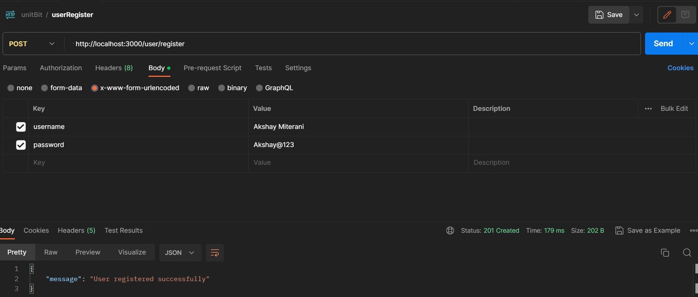
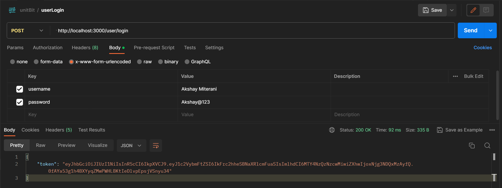
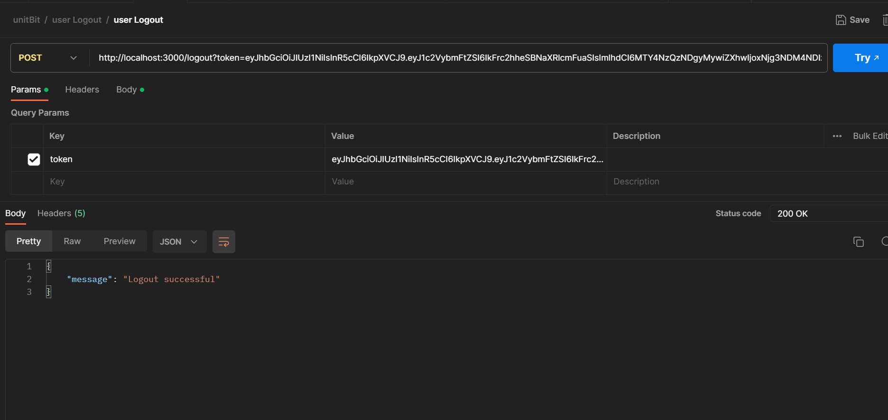
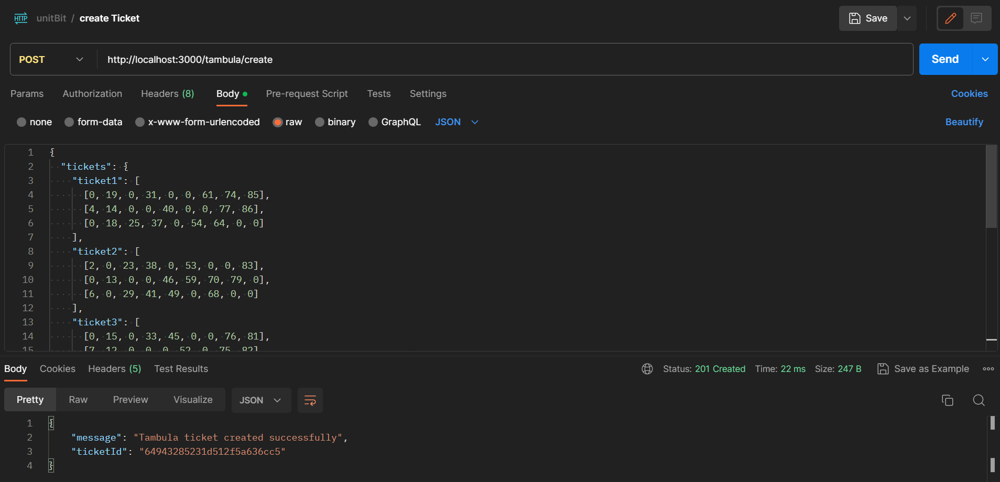
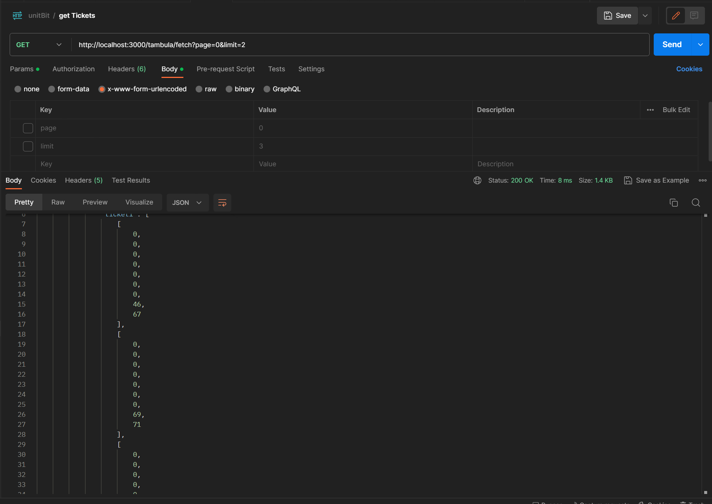

# Tambula Ticket Management System

The Tambula Ticket Management System is a Node.js application that provides APIs for user authentication, creating Tambula tickets, and fetching tickets with pagination.


## Authors

- [@Sambit Kumar Nayak](https://www.github.com/sambit985)

## Table of Contents
* Technologies Used
* Installation
* Features
* API Endpoints
* Contributing
* License

## Technologies Used
1.  Node.js
2.  Express.js
3.  MongoDB
4.  bcrypt (for password hashing)
5.  jsonwebtoken (JWT) (for user authentication)

## Installation
1. Clone the repository:

```bash
git clone <repository-url>
```
2. Install the dependencies:

```bash
npm install
```
3. Set up the environment variables:

* Create a .env file in the project root directory.
* Add the following environment variables to the .env file:

``` plaintext
PORT=<port-number>
MONGO_URI=<mongodb-connection-string>
SECRET_KEY=<secret-key-for-jwt>
```
1. Replace <port-number> with the desired port number (e.g., 3000).
2.  Replace <mongodb-connection-string> with the connection string for your MongoDB database.
3. Replace <secret-key-for-jwt> with a secret key used for JWT token generation.

### Start the server:

```bash
npm start
```
* The server will start running at http://localhost:<3000>.

## Features
* User registration and login with password hashing for secure authentication.
* Creation of Tambula tickets with unique ticket IDs.
* Fetching Tambula tickets with pagination.

## API Endpoints
1. User Registration
* Endpoint: POST /user/register
* Description: Registers a new user.

* Request Body:

```json
{
  "username": "exampleUser",
  "password": "examplePassword"
}
```
* Response:
```json
Copy code
{
  "message": "User registered successfully"
}
```
### User Login:-
* Endpoint: POST /user/login
* Description: Authenticates the user and returns a JWT token for further authorization.
* Request Body:
```json
{
  "username": "exampleUser",
  "password": "examplePassword"
}
```
* Response:
```json
{
  "token": "<jwt-token>"
}
```
### User Logout
* Endpoint: POST /user/logout
* Description: Performs user logout (currently only returns a success message).
*Request Body:
```json
{
  "token": "<jwt-token>"
}
```
* Response:
```json
{
  "message": "Logout successful"
}
```
## Create Tambula Ticket
* Endpoint: POST /tambula/create
* Description: Creates a Tambula ticket and returns a unique ticket ID.
* Request Body:
```json
{
  "tickets": [
    {
      "ticket": [
        [1, 0, 3, 0, 5, 0, 0, 8, 0],
        [10, 0, 12, 0, 14, 0, 16, 0, 0],
        ...
      ]
    },
    ...
  ]
}
```
* Response:
```json
{
  "message": "Tambula ticket created successfully",
  "ticketId": "<ticket-id>"
}
```

## Fetch Tambula Tickets
* Endpoint: GET /tambula/fetch?page=<page-number>&limit=<limit-per-page>
* Description: Fetches Tambula tickets with pagination.
### Query Parameters:
* page: The page number (starting from 0).
* limit: The number of tickets to fetch per page.
* Response:
```json
{
  "tickets": [
    {
      "_id": "<ticket-id>",
      "tickets": [
        {
          "ticket": [
            [1, 0, 3, 0, 5, 0, 0, 8, 0],
            [10, 0, 12, 0, 14, 0, 16, 0, 0],
            ...
          ]
        },
        ...
      ]
    },
    ...
  ]
}
```

## Endpoint Template











## Contributing
Contributions are welcome! If you find any issues or have suggestions for improvement, please feel free to open an issue or submit a pull request.

## License
This project is licensed under the MIT License.

Please note that this is just a sample README.md file, and you may need to modify it based on your specific project requirements and additional information you want to provide.